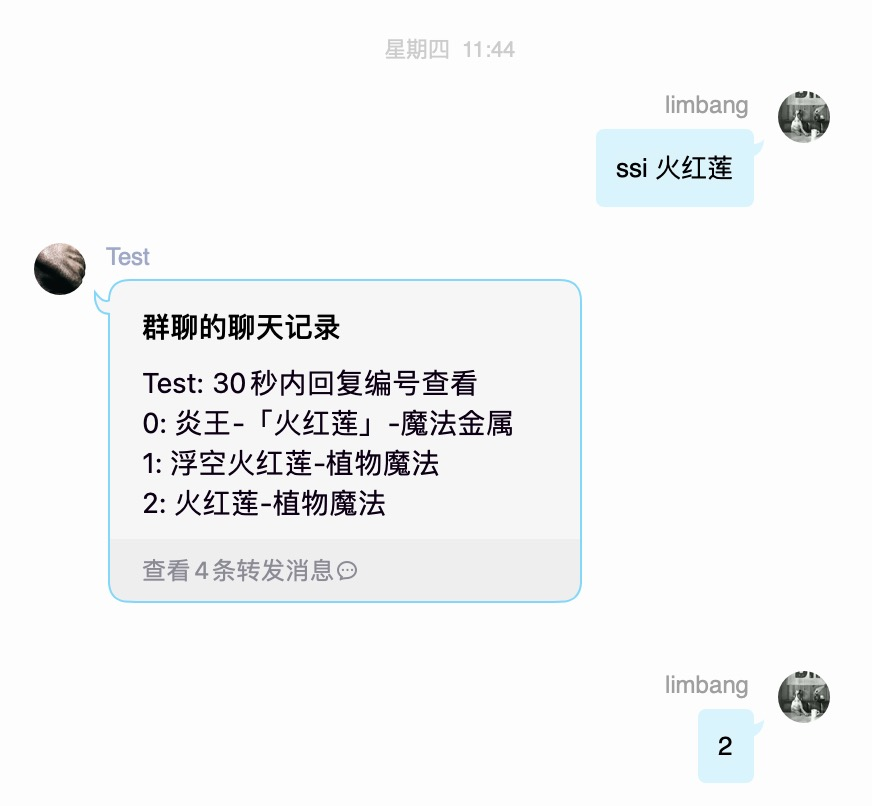
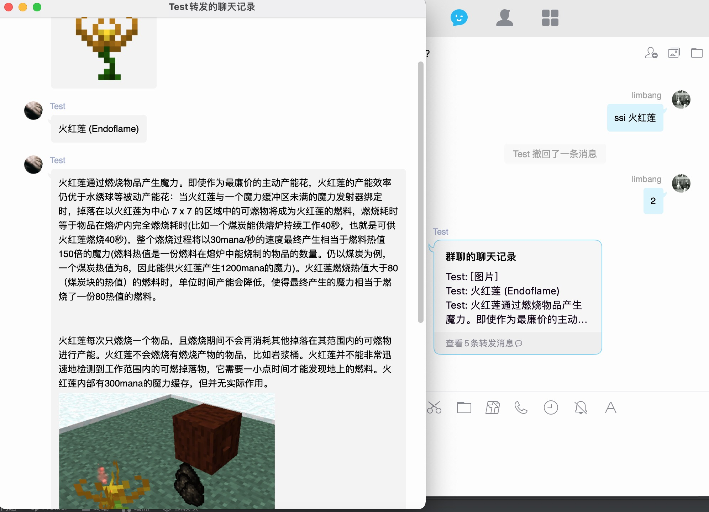
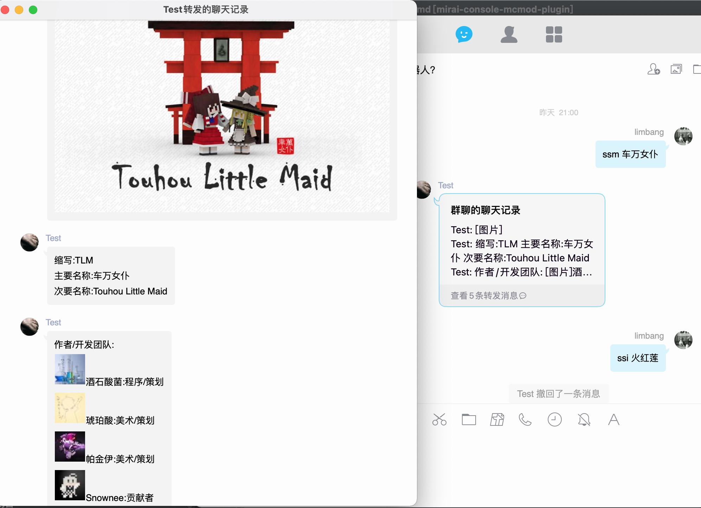
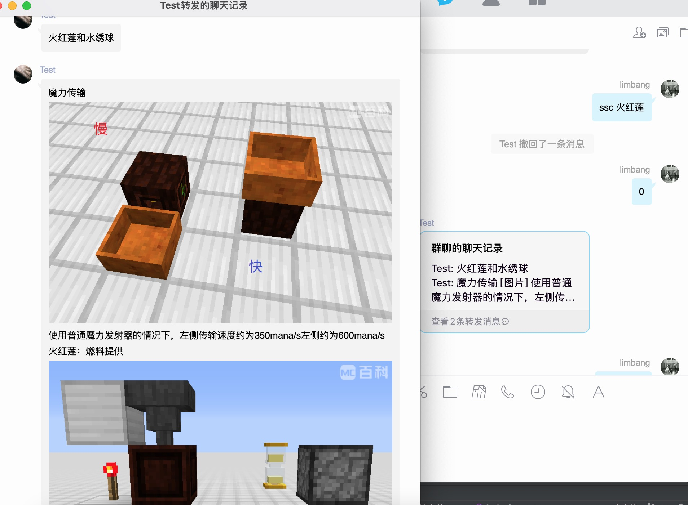
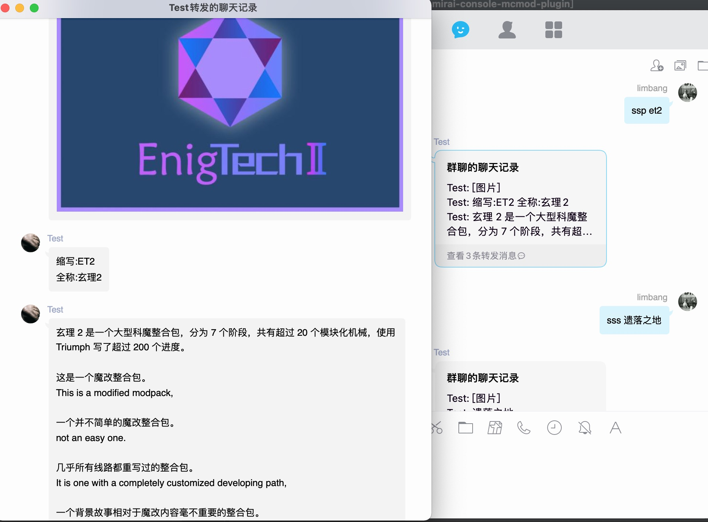

<div align="center">

[](https://github.com/limbang/mirai-console-mcmod-plugin/releases)

[](https://github.com/limbang/mirai-console-mcmod-plugin/blob/master/LICENSE)
[](https://github.com/mamoe/mirai)

本项目是基于 Mirai Console 编写的插件
<p>所有数据均来源于<a href = "https://www.mcmod.cn/">MC百科</a></p>
<p>戳一戳机器人头像可以获取帮助</p>
</div>

## 指令

```shell
# 修改搜索标签的命令
/mcmod setQueryCommand <type> <command>
```

`type`有如下类型:

- [ ] `ALL`:全部
- [x] `MODULE_PACKAGE`:整合包
- [x] `MODULE`:模组
- [x] `ITEM`:物品
- [x] `COURSE`:教程
- [ ] `AUTHOR`:作者
- [ ] `USER`:用户
- [ ] `COMMUNITY`:社群
- [x] `SERVER`:服务器

默认命令：

```shell
MODULE = ssm
ITEM = ssi
COURSE = ssc
MODULE_PACKAGE = ssp
SERVER = sss
```

其他配置直接更改配置文件:

路径:`config/top.limbang.mirai-console-mcmod-plugin/mcmod.yml`

```yaml
# 是否启用戳一戳回复功能 true:启用 false:禁用
isNudgeEnabled: true
# 是否启用群消息回复功能,默认回复群消息 true:启用 false:禁用
isGroupMessagesEnabled: true
# 是否启用好友消息回复功能,默认回复群消息 true:启用 false:禁用
isFriendMessagesEnabled: false
# 是否启用临时消息回复功能,默认回复群消息 true:启用 false:禁用
isTempMessagesEnabled: false
# 是否启用陌生人消息回复功能,默认回复群消息 true:启用 false:禁用
isStrangerMessagesEnabled: false
# 是否启用显示原Url功能,默认不启用 true:启用 false:禁用
isShowOriginalUrlEnabled: false
# 是否启用模组显示相关链接功能,默认不启用 true:启用 false:禁用
isShowRelatedLinksEnabled: false
# 是否启用模组显示支持版本功能,默认不启用 true:启用 false:禁用
isShowSupportedVersionEnabled: false
# 是否启用多次选择功能可以多次选择搜索的结果,默认不启用 true:启用 false:禁用
isMultipleSelectEnabled: false
# 每页显示多少条目,默认为 6
pageSize: 6
```

----

## 功能展示

搜索物品：


搜索模组：

搜索服务器：

搜索教程：

搜索整合包：


